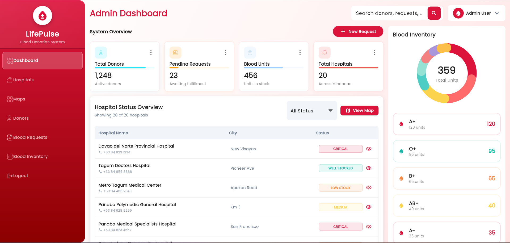
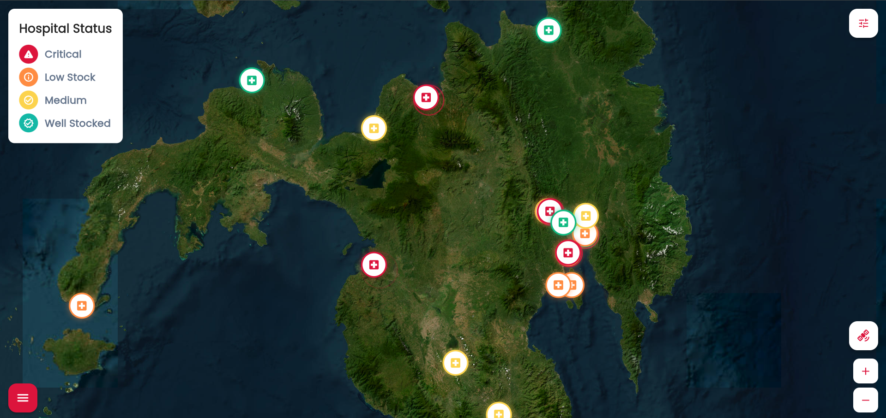

# LifePulse: Cloud-Based Blood Donation Management System

LifePulse is a cloud-ready, cross-platform blood donation management system built with Flutter and an AWS Amplify-based backend architecture. It connects hospitals, administrators, and donors through blood inventory tracking, urgent blood requests, donor appointments, notifications, and map-based hospital discovery.

This project was developed as the final project for **IT312 - Integrative Programming and Technologies 1** and **ITSPEC2 - Project Management**.


## Visual Showcase

### Website

<p>
  
  
</p>

### Mobile

<p>
  
  
  
  
</p>

### AWS Architecture

<p>
  
</p>

## Features

- Admin dashboard for blood inventory, hospital operations, donors, requests, appointments, and notifications.
- Donor-facing app shell with Home, Map, Appointments, Inbox, and Profile sections.
- Interactive hospital maps using `flutter_map`, Mapbox/OSM tile styles, urgency markers, filters, and hospital detail panels.
- Blood inventory tracking across major blood types with urgency states for critical, low, medium, and well-stocked hospitals.
- Appointment booking, cancellation, QR check-in display, and donation history views.
- Donor notifications for urgent requests, reminders, eligibility updates, and campaign-style alerts.
- Local demo backend with persisted data for hospitals, donors, appointments, blood requests, donation history, and notifications.
- AWS Amplify-ready architecture with GraphQL schema, Cognito/Auth service layer, AppSync-oriented service contracts, and retained cloud backend structure.
- Responsive UI for web, mobile browser, Android/iOS targets, and desktop Flutter targets.

## Tech Stack

- **Frontend:** Flutter, Dart, Material UI
- **State/UI:** Provider, responsive layouts, custom admin and donor design components
- **Maps:** flutter_map, latlong2, Mapbox tile styles, OpenStreetMap/Carto/OpenTopoMap tile options
- **Charts & Data UI:** fl_chart, custom dashboard cards, status chips, urgency indicators
- **Local Persistence:** shared_preferences-backed local backend store
- **Cloud Architecture:** AWS Amplify, Amazon Cognito, AWS AppSync GraphQL, Amazon DynamoDB, AWS Lambda, Amazon S3, IAM, Amazon CloudWatch
- **Platform Targets:** Web, Android, iOS, Windows, macOS, Linux

## Main App Areas

### Admin Side

- Dashboard overview
- Hospital management
- Admin map
- Donor management
- Appointment management
- Blood request workflow
- Blood inventory
- Notification management

### Donor/User Side

- Action-first donor home
- Hospital map and urgency filtering
- Appointment booking and QR check-in
- Inbox and alerts
- Donor profile, eligibility, preferences, and donation history

## Project Structure

```text
lib/
  main.dart                    # Main admin/donor login entry
  main_donor.dart              # Donor-focused entry
  main_donor_preview.dart      # Local donor demo preview
  constants.dart               # Theme tokens and map token constant
  controllers/                 # Menu and navigation state
  models/                      # Data models
  screens/
    auth/                      # Login and donor signup
    dashboard/                 # Admin dashboard
    hospitals/                 # Hospital management
    maps/                      # Admin map
    donors/                    # Donor management
    appointments/              # Appointment workflows
    blood_requests/            # Blood request workflows
    blood_inventory/           # Inventory screen
    notifications/             # Admin notifications
    donor/                     # Donor app shell and donor flows
    shared/                    # Shared admin layout components
  services/                    # Local/AWS service contracts

amplify/                       # AWS Amplify backend structure
schema.graphql                 # GraphQL schema reference
assets/                        # App images and icons
web/                           # Flutter web shell and PWA metadata
docs/screenshots/              # Project screenshots and architecture diagram
```

## Cloud Backend Status

LifePulse was originally designed around an AWS Amplify cloud backend using Cognito authentication, AppSync GraphQL APIs, DynamoDB tables, Lambda workflows, optional S3 file storage, IAM permissions, and CloudWatch monitoring.

The current public version keeps the AWS backend architecture and schema for showcase/reference while using local persisted demo data because the original AWS account/environment is no longer active.
